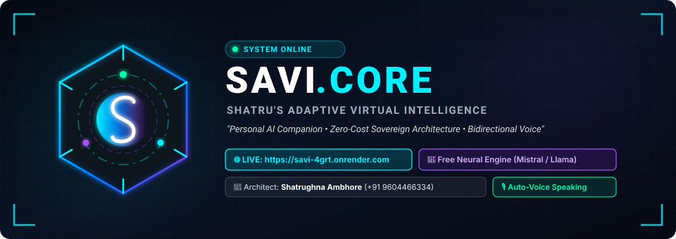
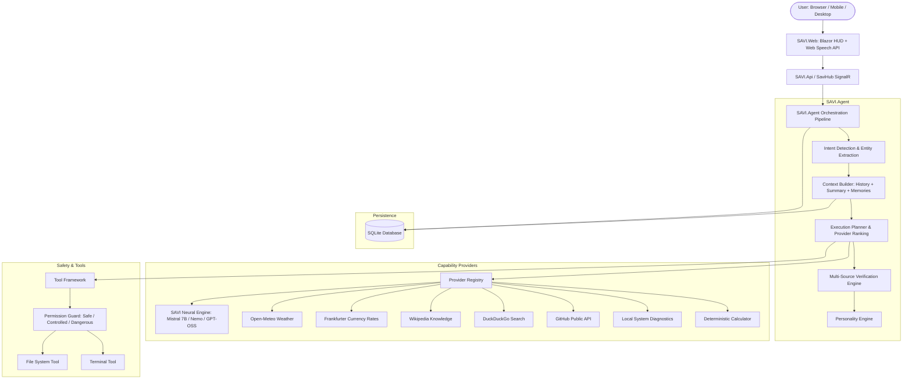
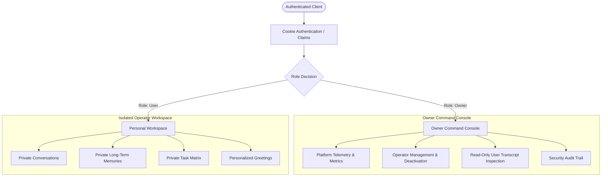

# SAVI — Shatru's Adaptive Virtual Intelligence

<div align="center">

<p align="center">
  
</p>

[](https://savi-4grt.onrender.com)
[](https://dotnet.microsoft.com/)
[](https://docs.microsoft.com/en-us/dotnet/csharp/)
[](https://dotnet.microsoft.com/apps/aspnet/signalr)
[](https://blazor.net/)
[](https://learn.microsoft.com/en-us/ef/core/)
[](#zero-cost-principle)
[-cyan?style=flat)](#5-built-in-capability-providers)
[-red?style=flat)](#6-two-tier-access-architecture--owner-admin-console)

### 🚀 **Live Hosted App**: [https://savi-4grt.onrender.com](https://savi-4grt.onrender.com)

**Architect & Developer**: **Shatrughna Ambhore**  
📧 **Email**: [ambhoreshatrughna@gmail.com](mailto:ambhoreshatrughna@gmail.com) | 📞 **Phone**: +91 9604466334

</div>

---

## 1. Product Vision

**SAVI (Shatru's Adaptive Virtual Intelligence)** is a sovereign personal AI companion and intelligent task-execution platform built on modern **.NET 10**.

SAVI is **NOT** a simple chatbot or generic API wrapper. SAVI behaves like a personal digital friend and sovereign companion that can:
* **Connect to Free AI Models**: Automatically queries serverless OpenAI-compatible inference endpoints (Mistral 7B Instruct, Mistral Nemo 2407, GPT-OSS 20B) for realistic, intelligent, and accurate responses with zero API keys and zero cost.
* **Real-Time Full-Duplex Voice Conversation**: Continuous conversational voice experience with live partial speech transcription, adaptive turn detection, streaming sentence-level speech playback, and instant barge-in interruption (<200ms stop latency).
* **Dedicated Immersive Voice Screen (`VoiceOverlay`)**: Interactive full-screen HUD featuring a central reactive SAVI reactor orb, dynamic audio ripple waves responding to voice levels, live dual transcript streams, and instant voice controls.
* **Auto-Speaking Welcome Voice**: Automatically begins speaking aloud ("Hello Shatru! I am SAVI...") when you open the URL, featuring browser autoplay security unlockers.
* **Two-Tier Access & Multi-User Data Isolation**: Secure two-tier role architecture (`Owner` and `User`) with strict workspace isolation for conversations, memory facts, and task matrices. Includes an owner-only telemetry command console with read-only operator inspection.
* **Maintain Deep Context & Long-Term Memory**: Remembers user preferences, past conversations, and facts in persistent SQLite memory.
* **Search & Verify with Multi-Source Consensus**: Discovers public knowledge bases, live weather, currency rates, GitHub repositories, and system diagnostics, verifying consensus before responding.
* **Execute Protected Local Tasks**: Guided by a strict 3-tier permission guard (Safe / Controlled / Dangerous) with interactive user confirmation modals for destructive actions.
* **Rich Cybernetic HUD Interface**: Futuristic JARVIS-inspired HUD with real-time audio wave telemetry, animated hexagonal core, responsive mobile drawer, search, and conversation management.

> *"SAVI feels like a personal digital friend who can actually get things done."*

---

## 2. Core Principles

### ✦ Zero-Cost Principle
SAVI is 100% free to develop and run with zero paid subscriptions:
- **Zero Mandatory Paid LLMs** (built-in free neural model endpoints with zero API keys required).
- **Zero Mandatory Paid Search APIs** (free DuckDuckGo instant answers & Wikipedia OpenSearch).
- **Zero Mandatory Paid Databases** (lightweight, zero-config EF Core SQLite).
- **Zero Mandatory Paid Speech Services** (native W3C Web Speech API for both STT and TTS).

### ✦ Real-Time Conversational Voice Engine
SAVI features a human-like, continuous voice conversation loop:
- **Full-Duplex Audio**: Microphone remains active while SAVI speaks (using browser Acoustic Echo Cancellation).
- **Instant Barge-In**: User interruptions immediately halt speech playback (<200ms audio stop latency) and cancel in-flight tasks without terminating the voice session.
- **Adaptive Turn Detection**: Intelligent pause buffering prevents accidental cutoffs on conjunctions (`and`, `or`, `because`, `if`, `that`) while executing instant single-word interrupts (`"wait"`, `"stop"`, `"keep it short"`).
- **Sentence-Level Streaming TTS**: Answers are chunked and streamed sentence-by-sentence to minimize time-to-first-audio.
- **Dedicated Voice Screen (`VoiceOverlay`)**: Interactive visual HUD featuring a pulsing SAVI reactor orb, dual real-time streaming transcripts, latency telemetry, and quick session controls.

### ✦ Model Independence & Fallback Cascade
SAVI dynamically ranks available capability providers. If an AI endpoint is temporarily busy, it seamlessly cascades through alternate models (Mistral 7B → Mistral Nemo → GPT-OSS → Wikipedia / DuckDuckGo), guaranteeing a responsive answer at all times.

---

## 3. System Architecture

SAVI adheres strictly to Clean Architecture and Domain-Driven Design:



---

## 4. Repository Structure

```text
SAVI/
├── src/
│   ├── SAVI.Core/            # Entities, Enums, Models, ValueObjects, Domain Interfaces
│   ├── SAVI.Application/     # Application Services, Repositories Interfaces, DTOs
│   ├── SAVI.Infrastructure/  # EF Core SQLite, Free AI Provider, Security, Audit
│   ├── SAVI.Agent/           # Orchestrator, Intent Routing, Planning, Verification, Personality
│   ├── SAVI.Tools/           # Permission Guard, FileSystem, Terminal Tools
│   ├── SAVI.Api/             # ASP.NET Core Minimal APIs & SignalR SaviHub
│   ├── SAVI.Web/             # Futuristic JARVIS-Inspired Blazor Server Web App
│   ├── SAVI.Desktop/         # Desktop Companion Client Host
│   └── SAVI.Mobile/          # Mobile Companion Client Architecture
│
├── tests/
│   ├── SAVI.Core.Tests/            # Entity & Value Object Unit Tests
│   ├── SAVI.Application.Tests/     # Service & Memory Tests
│   ├── SAVI.Agent.Tests/           # Intent, Verification & Personality Tests
│   ├── SAVI.Infrastructure.Tests/  # EF Core SQLite & Security Tests
│   └── SAVI.Api.Tests/             # API Contract & DTO Tests
│
├── docs/                     # Architectural guides, images & deployment docs
│   └── images/               # SAVI SVG Banner & Logo assets
├── scripts/                  # build.sh, test.sh, run.sh
├── Dockerfile                # Root Multi-stage Docker container for Cloud Hosting
├── render.yaml               # Render Infrastructure Blueprint
└── SAVI.sln                  # Master Solution File
```

---

## 5. Built-in Capability Providers & Intelligence Matrix

SAVI enforces a strict **Truth Ordering Principle**:
> *Authoritative source > specialized provider > generic reasoning model.*  
> Deterministic tasks (arithmetic, live weather, currency, system diagnostics) are never routed to slow, probabilistic LLMs.

| Provider | Capability | Category | Authority | Cost | Description |
| :--- | :--- | :---: | :---: | :---: | :--- |
| **Local System** | `system`, `time` | LocalDeterministic | 100% | **Local Zero-Cost** | Sub-10ms host diagnostics, CPU, RAM, clock |
| **Local Calculator** | `calculator` | LocalDeterministic | 100% | **Local Zero-Cost** | Deterministic arithmetic & unit conversion (<5ms) |
| **Open-Meteo** | `weather` | SpecializedPublicApi | 95% | **Free Public** | Geocoding + live conditions, temperature, humidity |
| **wttr.in** | `weather` | SpecializedPublicApi | 85% | **Free Public** | Fallback weather provider for consensus cross-verification |
| **Frankfurter** | `currency` | SpecializedPublicApi | 95% | **Free Public** | Live European Central Bank foreign exchange rates |
| **Wikidata** | `entity`, `knowledge` | KnowledgeBase | 90% | **Free Public** | Structured entity knowledge (people, dates, organizations) |
| **Crossref** | `research` | SpecializedPublicApi | 95% | **Free Public** | Academic research papers, DOIs, authors & journals |
| **Open Library** | `books` | SpecializedPublicApi | 90% | **Free Public** | Books, authors, ISBNs, and publication editions |
| **Hacker News** | `technews` | SpecializedPublicApi | 75% | **Free Public** | Real-time tech, startup, and developer discussions |
| **Nominatim / OSM** | `location` | SpecializedPublicApi | 95% | **Free Public** | OpenStreetMap coordinates and place geocoding |
| **CoinGecko** | `crypto` | SpecializedPublicApi | 90% | **Free Public** | Live keyless crypto market rates (USD, INR, EUR) |
| **GitHub Public** | `github` | SpecializedPublicApi | 95% | **Free Public** | Public repository stats, releases, and issue counts |
| **Wikipedia** | `knowledge` | KnowledgeBase | 85% | **Free Public** | Explanatory articles, biographies, and general history |
| **DuckDuckGo** | `search` | WebSearch | 70% | **Free Public** | Fast web search and fallback extraction |
| **SAVI Neural Engine** | `reasoning`, `synthesis` | ReasoningSynthesis | 30% (Source) | **Free Public** | Free reasoning and code synthesis (priority 55) |
| **Local Ollama** | `reasoning` | ReasoningSynthesis | 50% (Source) | **Optional Local** | Optional local model (`http://localhost:11434`) |

---

### ✦ VerificationPolicy & Parallel Execution
SAVI executes independent primary and verification providers **concurrently** via `Task.WhenAll(...)`:
* **`⚡ Fast`**: Queries single best provider with zero verification overhead.
* **`⚖ Balanced`** *(Default)*: Uses best provider; verifies only if information is time-sensitive or uncertain.
* **`🛡 Verified`**: Executes multiple independent providers concurrently and checks for cross-source consensus.

### ✦ Resilience, Circuit Breakers & In-Memory Caching
* **Circuit Breaker**: Detects 3 consecutive failures and trips circuit to `Open` (30s cooldown) before testing with `HalfOpen` probe.
* **In-Memory Cache & Request Coalescing**: De-duplicates simultaneous identical queries and caches results with provider-specific TTLs (24h geocoding, 6h wiki, 5m weather/fx, 30s crypto).
* **Zero Fake Timers**: The UI uses real backend execution callbacks and SignalR streaming events.

---

## 6. Two-Tier Access Architecture & Owner Admin Console

SAVI implements a robust multi-user role-based access control (RBAC) model with complete boundary isolation and dedicated administrative governance:



### ✦ Security Guarantees & Access Matrix

| Feature / Domain | Normal Operator (`User`) | Platform Owner (`Owner`) | Enforcement Mechanism |
| :--- | :---: | :---: | :--- |
| **Personal Chat & Voice** | ✅ Fully Private | ✅ Fully Private | Scoped by `UserId` in EF Core queries |
| **Long-Term Memory Facts** | ✅ Isolated Scope | ✅ Isolated Scope | Queries filtered by `UserId` |
| **Personal Task Matrix** | ✅ Isolated Scope | ✅ Isolated Scope | Queries filtered by `UserId` |
| **Command Console (`/admin`)** | ❌ Forbidden (`403`) | ✅ Full Access | `[Authorize(Roles = "Owner")]` & `RequireRole("Owner")` |
| **Operator Directory (`/admin/users`)** | ❌ Forbidden (`403`) | ✅ Full Access | Server-side authorization check |
| **Operator Inspection Mode** | ❌ Forbidden (`403`) | 👁️ **Read-Only** | Dedicated inspection viewer without send/voice controls |
| **User Deactivation / Status Toggle** | ❌ Forbidden (`403`) | ✅ Protected Action | Server-side `AdminService` with audit logging |
| **Self-Promotion to Owner** | ❌ Impossible | 🔒 Immutable | Registration strictly assigns `Role = Roles.User` |

### ✦ Key Security Principles
1. **Zero Self-Promotion**: Public registration strictly assigns `Role = Roles.User`. Roles cannot be elevated via client payloads, query strings, or local storage.
2. **Server-Side Authorization**: Security policies (`OwnerOnly`) are enforced at the ASP.NET Core pipeline and Blazor `AuthorizeRouteView` level.
3. **Data Boundary Enforcement**: Attempting to view another operator's conversation ID yields a 404 / null, and mutation attempts throw `UnauthorizedAccessException`.
4. **Read-Only Inspection Context**: When an Owner inspects an operator's conversation, a prominent `[READ-ONLY ADMINISTRATIVE INSPECTION MODE]` banner is displayed, and input submission or voice generation controls are physically omitted.
5. **Cryptographic Credential Security**: Passwords are encrypted using salted PBKDF2 SHA-512 via ASP.NET Core's `PasswordHasher<User>`.
6. **Automatic Owner Bootstrap & Data Migration**: If no Owner account exists on startup, SAVI bootstraps the primary Owner (`ambhoreshatrughna@gmail.com`) using environment variables (`SAVI_OWNER_EMAIL`, `SAVI_OWNER_PASSWORD`, `SAVI_OWNER_NAME`) and automatically migrates any pre-existing single-user data to the Owner profile.
7. **Dynamic Persona Greeting**: The AI companion greets each operator by their registered name (e.g., *"I'm listening, Rahul."* vs *"I'm listening, Shatru."*).

---

## 7. Safety & Tool Permissions

Every tool execution is guarded by the `IPermissionGuard`:
* **SAFE**: Reading files, inspecting system telemetry, math evaluation, searching public knowledge.
* **CONTROLLED**: Creating/writing files, automated web navigation.
* **DANGEROUS**: Deleting files, recursive directory removal, executing terminal shell commands.
  * *Dangerous actions pause execution and render an interactive approval modal requesting explicit user consent.*

---

## 8. Quick Start & Deployment

### Run Locally
```bash
# Build the entire solution
dotnet build /m:1 SAVI.sln

# Launch the Web HUD
dotnet run --project src/SAVI.Web/SAVI.Web.csproj --urls "http://localhost:5212"
```
Open **`http://localhost:5212`** in your browser to experience the holographic HUD!

### Run with Docker
```bash
docker build -t savi:latest .
docker run -p 5212:5212 savi:latest
```

### Deploy to Render
SAVI is deployed live on Render's Cloud platform:
* **Live Web App**: [https://savi-4grt.onrender.com](https://savi-4grt.onrender.com)
* **Healthcheck Endpoints**: `/healthz`, `/health`, `/api/health`
* Automatic dynamic `$PORT` environment variable binding.

---

## 9. Creator Information

SAVI was designed, architected, and built by:

* **Name**: **Shatrughna Ambhore**
* **Email**: [ambhoreshatrughna@gmail.com](mailto:ambhoreshatrughna@gmail.com)
* **Phone**: +91 9604466334
* **GitHub**: [@shatru123](https://github.com/shatru123)

---

## 10. License

This project is licensed under the [MIT License](LICENSE).

