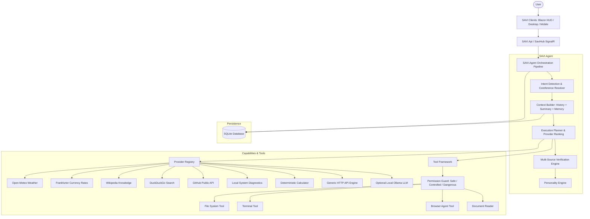

# SAVI — Shatru's Adaptive Virtual Intelligence

<div align="center">

```text
 ┌────────────────────────────────────────────────────────────┐
 │  SAVI // PERSONAL COMPANION              ● SYSTEM ONLINE   │
 ├────────────────────────────────────────────────────────────┤
 │                                                            │
 │                         SAVI CORE                          │
 │                       ◉ ◉ ◉ ◉ ◉                          │
 │                    ◉             ◉                         │
 │                  ◉      SAVI       ◉                       │
 │                    ◉             ◉                         │
 │                       ◉ ◉ ◉ ◉ ◉                            │
 │                                                            │
 │                    "I'm listening, Shatru."                │
 │                                                            │
 └────────────────────────────────────────────────────────────┘
```

[](https://dotnet.microsoft.com/)
[](https://docs.microsoft.com/en-us/dotnet/csharp/)
[](https://dotnet.microsoft.com/apps/aspnet/signalr)
[](https://blazor.net/)
[](https://learn.microsoft.com/en-us/ef/core/)
[](#zero-cost-principle)
[](#model-independence)

</div>

---

## 1. Product Vision

**SAVI (Shatru's Adaptive Virtual Intelligence)** is a personal AI companion and intelligent task-execution platform built from the ground up on modern **.NET 10**.

SAVI is **NOT** a simple chatbot or generic ChatGPT wrapper. SAVI behaves like a personal digital friend and intelligent companion that can:
* Understand natural language and maintain deep conversational context.
* Remember relevant facts, preferences, and project context in persistent long-term memory.
* Search public knowledge bases, open APIs, and public data sources.
* Discover and dynamically rank available capability providers.
* Compare information from multiple sources and verify certainty before answering.
* Execute multi-step tasks through protected local tools.
* Communicate with a friend-like, warm, and context-aware personality.
* Support bidirectional voice interaction out-of-the-box at zero cost.
* Provide a futuristic, holographic JARVIS-inspired HUD interface.

> *"SAVI should feel like a personal digital friend who can actually get things done."*

---

## 2. Core Principles

### ✦ Model Independence
SAVI does **NOT** require any specific AI model. OpenAI, Claude, Gemini, and Ollama are strictly optional. The core system operates autonomously through:
- Free public REST APIs (Open-Meteo, Frankfurter, Wikipedia, GitHub)
- Free public search engines (DuckDuckGo Instant Answers)
- Local deterministic math, unit conversion, and time evaluators
- User-configured generic HTTP endpoints
- Local filesystem and system tools
- Pluggable optional AI providers (e.g. local Ollama)

### ✦ Zero-Cost Principle
SAVI is 100% free to develop and run with zero paid third-party subscriptions:
- **NO mandatory paid LLM**
- **NO mandatory paid search API**
- **NO mandatory paid database or vector store**
- **NO mandatory paid speech-to-text or text-to-speech service**

---

## 3. System Architecture

SAVI adheres to Clean Architecture and Domain-Driven Design:



---

## 4. Repository Structure

```text
SAVI/
├── src/
│   ├── SAVI.Core/            # Entities, Enums, Models, ValueObjects, Domain Interfaces
│   ├── SAVI.Application/     # Application Services, Repositories Interfaces, DTOs
│   ├── SAVI.Infrastructure/  # EF Core SQLite, Free Providers, Security, Audit
│   ├── SAVI.Agent/           # Orchestrator, Intent Routing, Planning, Verification, Personality
│   ├── SAVI.Tools/           # Permission Guard, FileSystem, Terminal, Browser, Document Tools
│   ├── SAVI.Api/             # ASP.NET Core Minimal APIs & SignalR SaviHub
│   ├── SAVI.Web/             # Futuristic JARVIS-Inspired Blazor Server Web App
│   ├── SAVI.Desktop/         # Desktop Companion Client Host
│   └── SAVI.Mobile/          # Mobile Companion Client Architecture
│
├── tests/
│   ├── SAVI.Core.Tests/            # Entity & Value Object Unit Tests
│   ├── SAVI.Application.Tests/     # Service & Memory Tests
│   ├── SAVI.Agent.Tests/           # Intent, Verification & Personality Tests
│   ├── SAVI.Infrastructure.Tests/  # EF Core SQLite & Security Tests
│   └── SAVI.Api.Tests/             # API Contract & DTO Tests
│
├── docs/                     # Detailed architectural guides (9 guides)
├── scripts/                  # build.sh, test.sh, run.sh
├── docker/                   # Dockerfile and docker-compose.yml
├── .github/workflows/        # GitHub Actions CI Workflow
└── SAVI.sln                  # Master Solution File
```

---

## 5. Built-in Capability Providers

| Provider | Capability | Auth Required | Cost | Description |
| :--- | :--- | :---: | :---: | :--- |
| **Open-Meteo** | `weather` | None | Free | Geocoding + current/forecast weather |
| **wttr.in** | `weather` | None | Free | Secondary weather source for cross-verification |
| **Frankfurter** | `currency` | None | Free | Live European Central Bank exchange rates |
| **Wikipedia** | `knowledge` | None | Free | Encyclopedia article summaries & searches |
| **DuckDuckGo** | `search` | None | Free | Instant answers and web search extraction |
| **GitHub Public** | `github` | None | Free | Repository stats, releases, and issue counts |
| **Local System** | `system`, `time` | None | Free | Host OS diagnostics, CPU, RAM, clock |
| **Calculator** | `calculator` | None | Free | Deterministic math & unit conversions |
| **Generic HTTP** | User-defined | Optional | User | Custom JSON REST APIs with SSRF protection |
| **Ollama (Optional)** | `reasoning` | None | Free | Local LLM inference if running (`localhost:11434`) |

---

## 6. Safety & Tool Permissions

Every tool execution is guarded by the `IPermissionGuard`:
* **SAFE**: Reading files, inspecting system telemetry, math evaluation, searching public knowledge.
* **CONTROLLED**: Creating/writing files, automated web navigation, sending notifications.
* **DANGEROUS**: Deleting files, recursive directory removal, executing terminal shell commands.
  * *Dangerous actions pause execution and render an interactive approval modal requesting explicit user consent.*

---

## 7. Quick Start

### Prerequisites
* [.NET 10 SDK](https://dotnet.microsoft.com/download/dotnet/10.0) (`10.0.400` or newer)

### Build Solution
```bash
./scripts/build.sh
# or: dotnet build /m:1 SAVI.sln
```

### Run All Tests
```bash
./scripts/test.sh
# or: dotnet test SAVI.sln
```

### Launch Web App (HUD)
```bash
./scripts/run.sh
# or: dotnet run --project src/SAVI.Web/SAVI.Web.csproj
```
Open **`http://localhost:5000`** in your browser to experience the holographic HUD!

### Launch Standalone Headless API Service
```bash
dotnet run --project src/SAVI.Api/SAVI.Api.csproj --urls "http://127.0.0.1:5210"
```

### Run with Docker
```bash
docker compose -f docker/docker-compose.yml up --build
```

### Deploy to Render (Free Plan)
SAVI is fully pre-configured for **Render's Free Cloud Hosting Plan**:
- Includes [`render.yaml`](render.yaml) Blueprint and root [`Dockerfile`](Dockerfile).
- Built-in Health Checks on `/healthz` and `/health`.
- Automatic dynamic `$PORT` environment variable binding.
- Step-by-step deployment instructions: [`docs/render-deployment.md`](docs/render-deployment.md)

[](https://render.com/deploy)

---

## 8. Documentation

Comprehensive documentation is available in the [`docs/`](docs/) directory:
* [`docs/architecture.md`](docs/architecture.md) — Multi-layered architecture deep-dive
* [`docs/agent.md`](docs/agent.md) — 12-step agent orchestration pipeline
* [`docs/providers.md`](docs/providers.md) — Zero-cost provider system & custom API creation
* [`docs/memory.md`](docs/memory.md) — Long-term memory engine & privacy ownership
* [`docs/security.md`](docs/security.md) — SSRF protection, secret masking & permission levels
* [`docs/voice.md`](docs/voice.md) — Zero-cost W3C Web Speech integration & visual state machine
* [`docs/tools.md`](docs/tools.md) — File system, terminal, browser, and document tools
* [`docs/deployment.md`](docs/deployment.md) — Local, Docker, and production deployment guide
* [`docs/development.md`](docs/development.md) — Contributing & extending SAVI

---

## 9. License

This project is licensed under the [MIT License](LICENSE).
